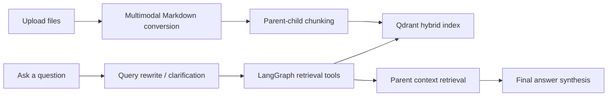

<h1 align="center">Multimodal Agentic RAG</h1>

<p align="center">
  <strong>A local-first RAG system for PDFs, images, tables, spreadsheets, and Office documents</strong>
  <br />
  <em>Multimodal ingestion · LangGraph agent · Qdrant hybrid retrieval · Gradio UI</em>
</p>

<p align="center">
  <a href="README.md">English</a> ·
  <a href="README.zh-CN.md">简体中文</a>
</p>

<p align="center">
  
  
  
  
  
</p>

---

Multimodal Agentic RAG is a local-first knowledge-base application. It converts PDFs, images, tables, spreadsheets, Office documents, HTML, text, and Markdown into searchable Markdown, indexes the content with parent-child chunking and hybrid Qdrant retrieval, then answers user questions through a LangGraph-powered agent.

The design keeps the original RAG architecture modular: multimodal files are normalized into Markdown first, then the existing chunking, vector indexing, retrieval tools, and answer synthesis pipeline handle them normally.

## Core Features

| Feature | Description |
| --- | --- |
| Multimodal upload | Supports PDF, images, CSV/TSV, Excel, DOCX, PPTX, HTML, TXT, and Markdown |
| OCR | Uses PaddleOCR to extract visible text from uploaded images |
| Image captioning | Uses Hugging Face Transformers with BLIP to generate searchable visual descriptions |
| Rich document parsing | Uses Docling to parse PDFs, DOCX, PPTX, and HTML into Markdown |
| Table extraction | Uses Camelot for PDF tables and pandas/openpyxl/xlrd for CSV and Excel files |
| Parent-child chunking | Searches smaller child chunks while retrieving larger parent chunks for context |
| Hybrid retrieval | Combines dense embeddings and sparse BM25 retrieval in Qdrant |
| Agentic workflow | LangGraph handles query rewriting, clarification, tool calls, context compression, and answer aggregation |
| Deterministic citations | Final answers append a source block with file names, parent chunk IDs, and evidence previews |
| Agent trace | The chat UI shows the original query, rewritten query, tool calls, tool results, and final-answer step |
| Evaluation CLI | Runs a QA set through the full agent and exports answer/source metrics to CSV |
| Local UI | Gradio provides document management and chat in one app |

## Supported Inputs

```text
.pdf, .md, .txt,
.png, .jpg, .jpeg, .webp, .bmp, .tif, .tiff,
.csv, .tsv, .xlsx, .xls,
.docx, .pptx, .html, .htm
```

## Architecture



## Project Structure

```text
project/
  app.py                         # Gradio app entry point
  config.py                      # Model, retrieval, and ingestion config
  document_chunker.py            # Parent-child chunking
  core/
    document_manager.py          # Upload, conversion, chunking, indexing
    multimodal_processor.py      # Image/table/document to Markdown adapters
    rag_system.py                # Qdrant, LLM, tools, graph bootstrap
    chat_interface.py            # Streaming chat adapter
    observability.py             # Optional Langfuse integration
  db/
    vector_db_manager.py         # Qdrant hybrid retrieval setup
    parent_store_manager.py      # Parent chunk storage
  rag_agent/
    graph.py                     # LangGraph workflow
    nodes.py                     # Query rewrite, retrieval, compression, aggregation
    tools.py                     # search_child_chunks and retrieve_parent_chunks
  ui/
    gradio_app.py                # Document upload and chat UI
```

## Quick Start

### 1. Create a Python environment

```bash
python3 -m venv .venv
source .venv/bin/activate
python -m pip install --upgrade pip
python -m pip install -r requirements.txt
```

### 2. Install and prepare Ollama

Install Ollama from [ollama.com](https://ollama.com), then pull the default chat model:

```bash
ollama pull granite4.1:8b
```

The default embedding model is `Qwen/Qwen3-Embedding-0.6B`. It will be downloaded by Hugging Face tooling on first use.

### 3. Run the app

```bash
python project/app.py
```

Open the local Gradio URL, upload files in the Documents tab, then ask questions in the Chat tab.

## Configuration

Main settings live in [project/config.py](project/config.py).

```python
DENSE_MODEL = "Qwen/Qwen3-Embedding-0.6B"
SPARSE_MODEL = "Qdrant/bm25"
LLM_MODEL = "granite4.1:8b"
RETRIEVAL_SCORE_THRESHOLD = 0.4
DEFAULT_RETRIEVAL_K = 7

IMAGE_CAPTION_MODEL = "Salesforce/blip-image-captioning-base"
PADDLEOCR_LANG = "ch"
TABLE_ROWS_PER_MARKDOWN_BLOCK = 200
```

Runtime data is intentionally excluded from Git:

```text
qdrant_db/
markdown_docs/
parent_store/
.env
.venv/
```

## First-Run Notes

Some formats initialize heavier models or parsers on first use:

- image captioning initializes a BLIP model through Transformers
- OCR initializes PaddleOCR
- document parsing initializes Docling
- PDF table extraction initializes Camelot

After conversion, all content is stored as Markdown and indexed through the same RAG pipeline.

## Validation

```bash
python3 -m compileall -q project
```

The multimodal conversion layer was smoke-tested with CSV and image inputs to verify Markdown generation before indexing.

## Evaluation

Create a QA file in the same format as [notebooks/data/multimodal_eval_sample.json](notebooks/data/multimodal_eval_sample.json), then run:

```bash
python project/evaluation.py \
  --qa notebooks/data/multimodal_eval_sample.json \
  --documents path/to/file.pdf path/to/table.xlsx path/to/image.png \
  --output rag_evaluation_results.csv
```

The evaluator runs the existing LangGraph agent and exports:

- final answer
- deterministic `Sources` block
- number of retrieved contexts
- reference-overlap proxy score
- expected-source hit rate

## License

This project keeps the original repository license. See [LICENSE](LICENSE).
