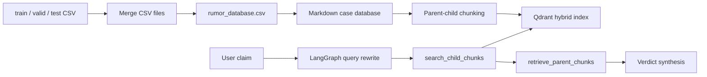

<h1 align="center">RumerDetection-rag</h1>

<p align="center">
  <strong>Agentic RAG for Chinese rumor detection over the original RumorDetection CSV dataset</strong>
  <br />
  <em>CSV merge · Qdrant hybrid retrieval · LangGraph agent · Evidence-grounded verdicts</em>
</p>

<p align="center">
  <a href="README.md">English</a> ·
  <a href="README.zh-CN.md">简体中文</a>
</p>

<p align="center">
  
  
  
  
</p>

---

RumerDetection-rag converts the original `GuMiShDo666/RumorDetection` train/validation/test CSV files into a single retrieval database and uses an Agentic RAG workflow to judge new Chinese claims.

Instead of training a BERT classifier, this version keeps the original labeled CSV data as the knowledge base. The system retrieves similar labeled cases, compares them with the user claim, and returns a verdict grounded in retrieved evidence.

## Core Features

| Feature | Description |
| --- | --- |
| Dataset merge | Merges `train.csv`, `valid.csv`, and `test.csv` into `data/rumor_database.csv` |
| Label mapping | `1 = 谣言`, `0 = 非谣言` |
| RAG database | Converts the merged CSV into Markdown cases for parent-child chunking |
| Hybrid retrieval | Uses Qdrant dense + sparse retrieval to find similar labeled claims |
| Agentic workflow | LangGraph handles query rewriting, retrieval tools, context compression, and final synthesis |
| Evidence-grounded verdict | Returns `谣言`, `非谣言`, or `证据不足` with supporting retrieved cases |
| Traceability | UI shows query rewrite, tool calls, retrieved context, and deterministic sources |

## Dataset

The original RumorDetection data is kept under `data/`:

```text
data/train.csv
data/valid.csv
data/test.csv
data/rumor_database.csv
```

Current merged database:

| Split | Rows |
| --- | ---: |
| train | 2685 |
| valid | 336 |
| test | 336 |
| total | 3357 |

Label distribution:

| Label | Meaning | Rows |
| --- | --- | ---: |
| 1 | 谣言 | 1844 |
| 0 | 非谣言 | 1513 |

## Architecture



## Quick Start

### 1. Install dependencies

```bash
python3 -m venv .venv
source .venv/bin/activate
python -m pip install --upgrade pip
python -m pip install -r requirements.txt
```

### 2. Prepare Ollama

Install Ollama from [ollama.com](https://ollama.com), then pull the default chat model:

```bash
ollama pull granite4.1:8b
```

The default embedding model is `Qwen/Qwen3-Embedding-0.6B`.

### 3. Launch the app

```bash
python project/app.py
```

Open the Gradio URL, click **Build / Rebuild Rumor RAG Database**, then enter a claim in the Chat tab.

## Evaluation

Run a lightweight QA evaluation:

```bash
python project/evaluation.py \
  --qa project/evaluation_sample.json \
  --output rag_evaluation_results.csv
```

The evaluator rebuilds the RAG database, runs the LangGraph agent, and exports:

- predicted verdict
- final answer
- deterministic sources
- retrieved context count
- reference-overlap proxy score
- expected-source hit rate

## Project Structure

```text
data/
  train.csv
  valid.csv
  test.csv
  rumor_database.csv
project/
  app.py
  config.py
  rumor_database.py
  document_chunker.py
  core/
    document_manager.py
    rag_system.py
    chat_interface.py
  db/
    vector_db_manager.py
    parent_store_manager.py
  rag_agent/
    graph.py
    nodes.py
    tools.py
    prompts.py
  ui/
    gradio_app.py
```

## Validation

```bash
python3 -m compileall -q project
python3 project/evaluation.py --help
python3 -m json.tool project/evaluation_sample.json
```

## Notes

- This project does not upload the original BERT training/inference code.
- The RAG workflow uses the original CSV labels as evidence.
- The system is evidence-grounded, not a medical authority. If retrieved cases are weak or conflicting, it should return `证据不足`.

## License

This project keeps the original repository license. See [LICENSE](LICENSE).
