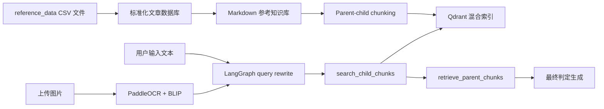

<h1 align="center">RumerDetection-rag</h1>

<p align="center">
  <strong>支持文本和图片输入的中文谣言检测 Agentic RAG 系统</strong>
  <br />
  <em>OCR + BLIP 图片解析 · 参考文章知识库 · Qdrant 混合检索 · LangGraph Agent</em>
</p>

<p align="center">
  <a href="README.md">English</a> ·
  <a href="README.zh-CN.md">简体中文</a>
</p>

<p align="center">
  
  
  
  
</p>

---

RumerDetection-rag 是一个面向中文文本和图片输入的检索增强谣言检测应用。系统将辟谣文章和健康科普文章保存为可检索知识库，针对新的用户输入检索相关证据，再通过 Agent 工作流生成有依据的判定。

系统优先使用检索证据回答问题；当相关文章证据不足或证据较弱时，会返回 `证据不足`，而不是强行二分类。

## 核心能力

| 能力 | 说明 |
| --- | --- |
| 文本和图片检测 | 支持在 Chat UI 中直接输入文本，或上传包含待检测信息的图片 |
| OCR + BLIP 解析 | 使用 PaddleOCR 提取图片文字，使用 BLIP 生成图片说明 |
| 参考文章知识库 | 使用 `data/reference_data` 下的 17 个 CSV 来源作为 RAG 语料 |
| 文章标准化 | 构建时生成 `data/rumor_database.csv`，字段包括 `id`、`source`、`title`、`url`、`date` 和 `text` |
| 混合检索 | 使用 Qdrant dense + sparse 检索相关参考文章 |
| Agentic workflow | 使用 LangGraph 负责问题改写、工具检索、上下文压缩和最终生成 |
| 证据化判定 | 输出 `谣言`、`非谣言` 或 `证据不足`，并附相关文章依据 |

## 知识库

源语料保存在 `data/reference_data/`，包含 17 个辟谣和健康科普 CSV 文件。构建数据库时会过滤空正文、去重，并在本地生成 `data/rumor_database.csv` 用于索引。

生成后的数据库格式：

```csv
id,source,title,url,date,text
REF-00001,中华医学健康科普知识库,老年人总穿拖鞋易疲劳，拖鞋挑选有讲究,https://...,2022-05-18,...
```

当前索引语料统计：

| 项目 | 数量 |
| --- | ---: |
| Source CSV files | 17 |
| Indexed articles | 17183 |
| Empty-text rows skipped | 691 |
| Duplicate rows skipped | 298 |

## 架构



## 快速开始

### 1. 安装依赖

```bash
python3 -m venv .venv
source .venv/bin/activate
python -m pip install --upgrade pip
python -m pip install paddlepaddle==3.0.0 -i https://www.paddlepaddle.org.cn/packages/stable/cpu/
python -m pip install -r requirements.txt
```

上面的 CPU PaddlePaddle 命令用于支持 PaddleOCR。GPU 或特殊平台安装方式请参考 [PaddleOCR installation guide](https://paddlepaddle.github.io/PaddleOCR/v3.1.1/en/quick_start.html)。

### 2. 准备 Ollama

从 [ollama.com](https://ollama.com) 安装 Ollama，然后拉取默认聊天模型：

```bash
ollama pull granite4.1:8b
```

默认 embedding 模型是 `Qwen/Qwen3-Embedding-0.6B`。

### 3. 启动应用

```bash
python project/app.py
```

打开 Gradio 地址，点击 **Build / Rebuild Reference RAG Database**，然后在 Chat 页输入待检测文本或上传图片。

## 评测

运行轻量 QA 评测：

```bash
python project/evaluation.py \
  --qa project/evaluation_sample.json \
  --output rag_evaluation_results.csv
```

评测脚本会重建 RAG 数据库、运行 LangGraph Agent，并导出 predicted verdict、final answer、deterministic sources、retrieved context count、reference-overlap proxy score 和 expected-source hit rate。

## 项目结构

```text
data/
  reference_data/
    *.csv
  rumor_database.csv  # 本地生成
project/
  app.py
  config.py
  rumor_database.py
  document_chunker.py
  core/
    document_manager.py
    image_claim_extractor.py
    rag_system.py
    chat_interface.py
  db/
    vector_db_manager.py
    parent_store_manager.py
  rag_agent/
    graph.py
    nodes.py
    tools.py
    prompts.py
  ui/
    gradio_app.py
```

## 验证

```bash
python3 -m compileall -q project
python3 project/evaluation.py --help
python3 -m json.tool project/evaluation_sample.json
```

## 说明

- 系统使用检索到的文章作为证据，而不是只依赖训练好的分类器。
- 参考文章语料是文本和图片谣言检测的主要检索来源。
- 图片输入会先被解析后再进入检索流程，其中 OCR 文本是主要信号，BLIP 图片说明作为补充上下文。
- 第一次使用图片检测时，可能会下载 OCR 和 BLIP 模型权重。
- 回答以 `判定：谣言`、`判定：非谣言` 或 `判定：证据不足` 开头。
- 该系统是基于证据的辅助判断工具，不是通用医学或法律权威。

## License

详见 [LICENSE](LICENSE)。
