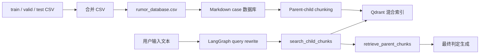

<h1 align="center">RumerDetection-rag</h1>

<p align="center">
  <strong>基于原 RumorDetection CSV 数据库的中文谣言检测 Agentic RAG 系统</strong>
  <br />
  <em>CSV 合并 · Qdrant 混合检索 · LangGraph Agent · 基于证据的谣言判定</em>
</p>

<p align="center">
  <a href="README.md">English</a> ·
  <a href="README.zh-CN.md">简体中文</a>
</p>

<p align="center">
  
  
  
  
</p>

---

RumerDetection-rag 将原始 `GuMiShDo666/RumorDetection` 项目里的 `train.csv`、`valid.csv`、`test.csv` 合并为一个检索数据库，并使用 Agentic RAG 工作流对新的中文文本进行谣言检测。

这个版本不再保留 BERT 训练和模型推理代码，而是把原来的已标注 CSV 数据作为 RAG 知识库。系统会检索相似的已标注案例，比较用户输入与数据库案例，最后给出基于证据的判定。

## 核心能力

| 能力 | 说明 |
| --- | --- |
| 数据集合并 | 将 `train.csv`、`valid.csv`、`test.csv` 合并为 `data/rumor_database.csv` |
| 标签映射 | `1 = 谣言`，`0 = 非谣言` |
| RAG 数据库 | 将合并后的 CSV 转为 Markdown case，用于 parent-child chunking |
| 混合检索 | 使用 Qdrant dense + sparse 检索相似已标注文本 |
| Agentic workflow | LangGraph 负责问题改写、工具检索、上下文压缩和最终聚合 |
| 证据化判定 | 输出 `谣言`、`非谣言` 或 `证据不足`，并附相似案例依据 |
| 可追踪性 | UI 展示 query rewrite、tool calls、retrieved context 和 deterministic sources |

## 数据集

原 RumorDetection 数据保留在 `data/`：

```text
data/train.csv
data/valid.csv
data/test.csv
data/rumor_database.csv
```

当前合并后的数据库：

| Split | Rows |
| --- | ---: |
| train | 2685 |
| valid | 336 |
| test | 336 |
| total | 3357 |

标签分布：

| Label | 含义 | Rows |
| --- | --- | ---: |
| 1 | 谣言 | 1844 |
| 0 | 非谣言 | 1513 |

## 架构



## 快速开始

### 1. 安装依赖

```bash
python3 -m venv .venv
source .venv/bin/activate
python -m pip install --upgrade pip
python -m pip install -r requirements.txt
```

### 2. 准备 Ollama

从 [ollama.com](https://ollama.com) 安装 Ollama，然后拉取默认聊天模型：

```bash
ollama pull granite4.1:8b
```

默认 embedding 模型是 `Qwen/Qwen3-Embedding-0.6B`。

### 3. 启动应用

```bash
python project/app.py
```

打开 Gradio 地址，点击 **Build / Rebuild Rumor RAG Database**，然后在 Chat 页输入待检测文本。

## 评测

运行轻量 QA 评测：

```bash
python project/evaluation.py \
  --qa project/evaluation_sample.json \
  --output rag_evaluation_results.csv
```

评测脚本会重建 RAG 数据库、运行 LangGraph Agent，并导出：

- predicted verdict
- final answer
- deterministic sources
- retrieved context count
- reference-overlap proxy score
- expected-source hit rate

## 项目结构

```text
data/
  train.csv
  valid.csv
  test.csv
  rumor_database.csv
project/
  app.py
  config.py
  rumor_database.py
  document_chunker.py
  core/
    document_manager.py
    rag_system.py
    chat_interface.py
  db/
    vector_db_manager.py
    parent_store_manager.py
  rag_agent/
    graph.py
    nodes.py
    tools.py
    prompts.py
  ui/
    gradio_app.py
```

## 验证

```bash
python3 -m compileall -q project
python3 project/evaluation.py --help
python3 -m json.tool project/evaluation_sample.json
```

## 说明

- 本项目不上传原来的 BERT 训练/推理代码。
- RAG 工作流使用原始 CSV 标签作为判定证据。
- 系统是基于检索证据的辅助判断，不是医学权威；当相似案例不足或冲突时，应输出 `证据不足`。

## License

本项目保留原仓库许可证，详见 [LICENSE](LICENSE)。
