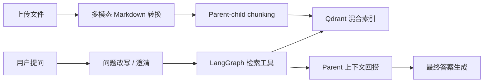

<h1 align="center">Multimodal Agentic RAG</h1>

<p align="center">
  <strong>面向 PDF、图片、表格、电子表格和 Office 文档的本地优先多模态 RAG 系统</strong>
  <br />
  <em>多模态入库 · LangGraph Agent · Qdrant 混合检索 · Gradio 界面</em>
</p>

<p align="center">
  <a href="README.md">English</a> ·
  <a href="README.zh-CN.md">简体中文</a>
</p>

<p align="center">
  
  
  
  
  
</p>

---

Multimodal Agentic RAG 是一个本地优先的知识库问答应用。它可以把 PDF、图片、表格、电子表格、Office 文档、HTML、纯文本和 Markdown 统一转换为可检索的 Markdown，再通过 parent-child chunking 和 Qdrant 混合检索建立知识库，最后由 LangGraph 驱动的 Agent 根据检索证据回答问题。

这个项目的核心思路是保留原有 RAG 架构：多模态文件先被标准化成 Markdown，然后继续复用已有的切分、向量索引、检索工具和答案生成流程。

## 核心能力

| 能力 | 说明 |
| --- | --- |
| 多模态上传 | 支持 PDF、图片、CSV/TSV、Excel、DOCX、PPTX、HTML、TXT 和 Markdown |
| OCR | 使用 PaddleOCR 提取图片中的可见文字 |
| 图片说明 | 使用 Hugging Face Transformers + BLIP 生成可检索的图片描述 |
| 复杂文档解析 | 使用 Docling 将 PDF、DOCX、PPTX 和 HTML 解析为 Markdown |
| 表格抽取 | 使用 Camelot 抽取 PDF 表格，使用 pandas/openpyxl/xlrd 处理 CSV 和 Excel |
| Parent-child chunking | 用较小 child chunk 做精准搜索，用较大 parent chunk 补充上下文 |
| 混合检索 | 在 Qdrant 中结合 dense embedding 和 sparse BM25 检索 |
| Agentic workflow | LangGraph 负责任务改写、澄清、工具调用、上下文压缩和答案聚合 |
| 稳定引用溯源 | 最终答案追加来源区块，包含文件名、parent chunk ID 和证据片段预览 |
| Agent trace | 聊天界面展示原始问题、改写问题、工具调用、工具结果和最终回答步骤 |
| 评测 CLI | 将 QA 集跑完整 Agent 流程，并导出答案和来源指标到 CSV |
| 本地界面 | Gradio 提供文档管理和聊天问答入口 |

## 支持的输入格式

```text
.pdf, .md, .txt,
.png, .jpg, .jpeg, .webp, .bmp, .tif, .tiff,
.csv, .tsv, .xlsx, .xls,
.docx, .pptx, .html, .htm
```

## 架构



## 项目结构

```text
project/
  app.py                         # Gradio 应用入口
  config.py                      # 模型、检索和入库配置
  document_chunker.py            # Parent-child chunking
  core/
    document_manager.py          # 上传、转换、切分、索引
    multimodal_processor.py      # 图片/表格/文档转 Markdown 适配器
    rag_system.py                # Qdrant、LLM、工具、Graph 初始化
    chat_interface.py            # 流式聊天适配层
    observability.py             # 可选 Langfuse 观测
  db/
    vector_db_manager.py         # Qdrant 混合检索配置
    parent_store_manager.py      # Parent chunk 存储
  rag_agent/
    graph.py                     # LangGraph 工作流
    nodes.py                     # 问题改写、检索、压缩、聚合节点
    tools.py                     # search_child_chunks 和 retrieve_parent_chunks
  ui/
    gradio_app.py                # 文件上传和聊天 UI
```

## 快速开始

### 1. 创建 Python 环境

```bash
python3 -m venv .venv
source .venv/bin/activate
python -m pip install --upgrade pip
python -m pip install -r requirements.txt
```

### 2. 安装并准备 Ollama

从 [ollama.com](https://ollama.com) 安装 Ollama，然后拉取默认聊天模型：

```bash
ollama pull granite4.1:8b
```

默认 embedding 模型是 `Qwen/Qwen3-Embedding-0.6B`，首次运行时会通过 Hugging Face 相关工具下载。

### 3. 启动应用

```bash
python project/app.py
```

打开本地 Gradio 地址，在 Documents 页上传文件，然后在 Chat 页提问。

## 配置

主要配置在 [project/config.py](project/config.py)。

```python
DENSE_MODEL = "Qwen/Qwen3-Embedding-0.6B"
SPARSE_MODEL = "Qdrant/bm25"
LLM_MODEL = "granite4.1:8b"
RETRIEVAL_SCORE_THRESHOLD = 0.4
DEFAULT_RETRIEVAL_K = 7

IMAGE_CAPTION_MODEL = "Salesforce/blip-image-captioning-base"
PADDLEOCR_LANG = "ch"
TABLE_ROWS_PER_MARKDOWN_BLOCK = 200
```

运行时数据不会提交到 Git：

```text
qdrant_db/
markdown_docs/
parent_store/
.env
.venv/
```

## 首次运行说明

部分格式首次上传时会初始化较重的模型或解析器：

- 图片说明会通过 Transformers 初始化 BLIP 模型
- OCR 会初始化 PaddleOCR
- 文档解析会初始化 Docling
- PDF 表格抽取会初始化 Camelot

转换完成后，所有内容都会以 Markdown 形式进入同一套 RAG 入库流程。

## 验证

```bash
python3 -m compileall -q project
```

多模态转换层已用 CSV 和图片输入做过轻量 smoke test，确认在索引前可以正常生成 Markdown。

## 评测

按 [notebooks/data/multimodal_eval_sample.json](notebooks/data/multimodal_eval_sample.json) 的格式准备 QA 文件，然后运行：

```bash
python project/evaluation.py \
  --qa notebooks/data/multimodal_eval_sample.json \
  --documents path/to/file.pdf path/to/table.xlsx path/to/image.png \
  --output rag_evaluation_results.csv
```

评测脚本会调用现有 LangGraph Agent，并导出：

- 最终答案
- deterministic `Sources` 来源区块
- 检索上下文数量
- reference overlap 代理分数
- expected source hit rate 来源命中率

## 简历亮点

- 为 PDF、图片、表格、电子表格和 Office 文档构建多模态 RAG 入库层。
- 集成 Docling、PaddleOCR、Transformers/BLIP、Camelot、Qdrant 和 LangGraph 等开源工具。
- 通过“统一转 Markdown”的方式保留模块化 RAG 架构，避免重写检索和 Agent 流程。
- 实现包含问题改写、澄清、工具检索、上下文压缩、trace 可视化、稳定引用溯源和评测指标的 Agentic RAG 工作流。

## License

本项目保留原仓库许可证，详见 [LICENSE](LICENSE)。
